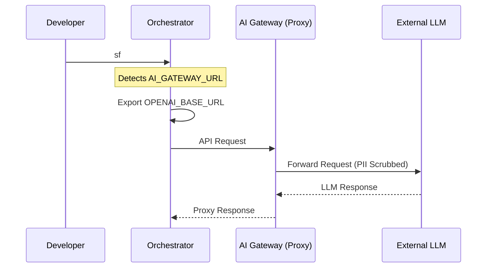

# Vision & Strategy

## The AI Exoskeleton Philosophy
The goal of this system is not to create an unsupervised "runaway script" that magically builds apps. Instead, it is a highly opinionated **AI Exoskeleton**. It gives developers leverage by doing the heavy lifting of writing code, tests, and documentation, while yielding control back to humans at critical architectural junctures.

## Security, Data Privacy & Model Governance
In a team environment, preventing Intellectual Property (IP) leaks is paramount. The system utilizes the **"Graceful Fallback" (Gateway Override)** pattern using standard OpenAI API structures.

*   **Solo Developers**: Configure `ANTHROPIC_API_KEY` or `OPENAI_API_KEY` in their local `.env`. The system connects directly to the providers.
*   **Enterprise Teams**: The organization provisions a secure AI Gateway (e.g., Cloudflare AI Gateway, LiteLLM) configured for zero data retention. Developers are given an `AI_GATEWAY_URL`.
*   **The Enforcement**: If the Orchestrator detects `AI_GATEWAY_URL`, it automatically overrides all individual tool configurations (Pi, OpenCode, etc.) by exporting `OPENAI_BASE_URL=$AI_GATEWAY_URL`. It strictly forces all agent traffic through the corporate proxy, ensuring compliance without modifying the underlying tools.

### Gateway Override Workflow


## Telemetry, ROI & Observability
To measure the ROI of the AI system, we must track token consumption and time saved. 
The system natively writes to an append-only JSON Lines file: `./.agents/telemetry.jsonl`.

**Example Entry:**
```json
{"timestamp": 1715420000, "phase": "implementation", "task_id": "TASK-5", "duration_sec": 45, "estimated_tokens": 12500, "exit_code": 0}
```
*   **Solo Devs**: Can parse this locally to track their token spend.
*   **Teams**: CI/CD pipelines or local log-shippers (like Promtail/Datadog agent) can effortlessly sweep this `.jsonl` file to build centralized Grafana dashboards detailing the org's AI velocity.