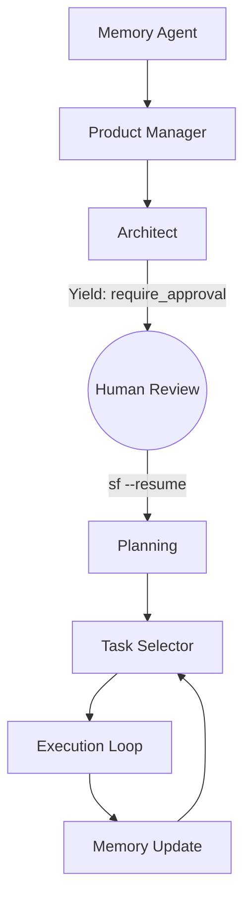
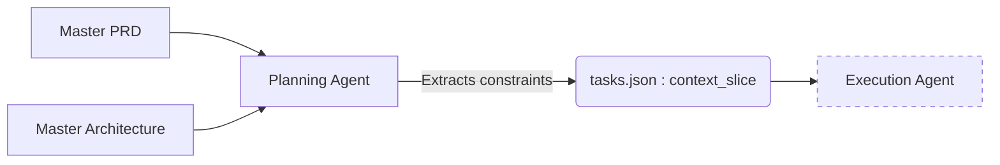

# System Architecture

## The DAG State Machine
The core of the system is the Orchestrator, a lightweight state machine (Bash/Node) that manages isolated AI sessions. It reads `.agent-state.json` and transitions through a Directed Acyclic Graph (DAG) based on exit codes and strict handoff contracts.

### DAG Workflow


## Human-in-the-Loop (HITL) Yield Points
The system is not a runaway train. By default, major architectural phases are tagged with `require_approval: true` in the `agent-pipeline.yml` config.

When the `architect` agent finishes writing `architecture.md`, the Orchestrator exits gracefully:
> *Phase 'architect' complete. Please review `docs/architecture.md`. Run `sf --resume` to proceed.*

This allows human Staff Engineers to maintain strict editorial control over the system's design direction.

::: tip ⚙️ Configuration
Yield points are configurable per playbook. You can disable them by setting `require_approval: false` in `.agent-pipeline.yml` for rapid prototyping.
:::

## Task-Scoped Context Slicing (The "Need to Know" Principle)
Providing the entire codebase and PRD to an implementation agent causes token bloat and context degradation.

When the `planning` agent breaks down work, it extracts specific constraints into a `context_slice`:
```json
{
  "id": "TASK-5",
  "title": "Create User Avatar Component",
  "context_slice": "From PRD: Must support PNG/JPG up to 2MB. From Arch: Use Tailwind for styling."
}
```
The Execution agents only receive this slice in their prompt, drastically reducing hallucinations and token costs.

### Context Slicing Workflow


## Monolithic Versioning & Project Pegging
*   **Global Registry**: `~/.agent-system/versions/v0.1.0/` houses the tested matrix of orchestrator scripts, prompts, and config defaults.
*   **Project Pegging**: Each project contains an `.agent-version` file (e.g., `v0.1.0`). When `sf` is invoked, it dynamically sources the exact global version requested. This ensures that upgrading the system globally never breaks older projects.