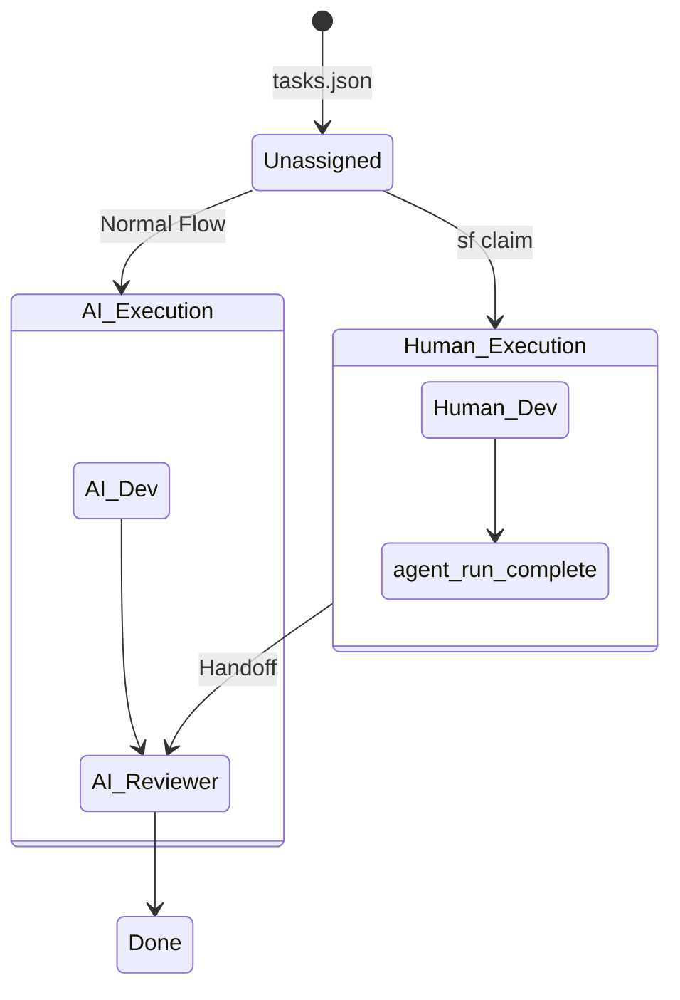

# Developer Ergonomics & Human-AI Pairing

This system is built for human-AI collaboration. Developers and AI agents must safely co-exist within the same sprint without Git race conditions or state corruption.

## Task Claiming (Human-Agent Pairing)
The AI Orchestrator acts on `tasks.json`. Humans can intercept and complete tasks seamlessly using the CLI.

**Workflow:**
1. You want to build the UI for TASK-3 yourself.
2. Run `sf claim TASK-3`.
3. The Orchestrator updates `tasks.json` (`assigned_role: human`), checks out a Git branch (`git checkout -b human/TASK-3`), and suspends AI assignment for this ticket.

::: warning ⚠️ Branch Discipline
Do not switch branches or run `sf --resume` in another terminal while actively working on a claimed task. Finish the code and run `sf complete` first to prevent state corruption.
:::

4. You write the code.
5. Run `sf complete TASK-3`.
6. The Orchestrator stages your work and hands the state machine over to the AI `reviewer` agent to audit your human code.

### Task Claiming Workflow

## The Escape Hatch (Intervening in stuck loops)
If an AI agent is stuck in an infinite loop (e.g., repeatedly failing a TDD test):

*   **Manual Interrupt (Ctrl+C)**: Traps the `SIGINT` signal, gracefully halts the AI process, marks the state as `paused` in `.agent-state.json`, and yields the terminal. You fix the code, then run `sf --resume`.
*   **Auto-Suspension (3-Strike Rule)**: If an agent hits `max_retries: 3` (e.g., exit code 1 three times), the system automatically pauses and prompts:
    > *TASK-5 failed 3 times. Options: [R]etry, [S]kip, [M]anual Override, [A]bort.*