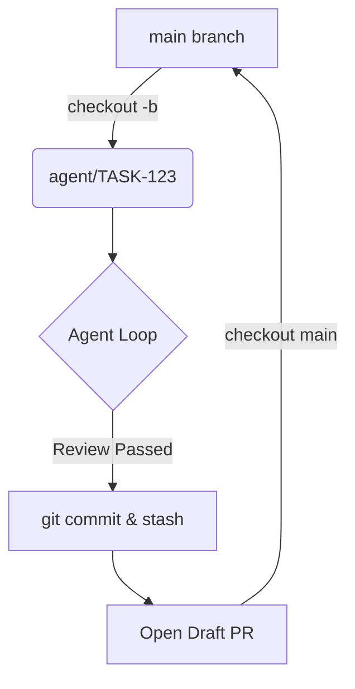
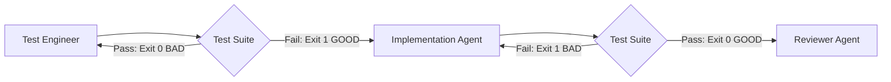

# Execution & Adversarial TDD

Execution phases are strictly controlled to guarantee code quality and prevent the AI from making destructive changes to the working directory.

## Git-Sandboxed Execution
The AI is not allowed to edit the main working branch directly. 
When `task-selector` picks a task, the Orchestrator executes:
`git checkout -b agent/TASK-[ID]-[slug]`

All work happens here. Once the `reviewer` agent passes the task:
1. The Orchestrator creates a conventional commit: `feat(scope): title [TASK-ID]`
2. Opens a Draft PR via the `github-mcp` (if configured).
3. Resets the working directory to `main` before pulling the next task.
*(Note: This branch isolation paves the way for V2, where multiple AI sessions can execute tasks in parallel).*

### Git Sandbox Workflow

## Adversarial TDD Handoff
To prevent the "Fox Guarding the Henhouse" problem where an LLM writes useless tautological tests just to satisfy a requirement, we decouple testing into an adversarial flow:

1.  **Step A (`test-engineer`):** Reads the `context_slice` and writes a `.spec.ts` file. 
    *   *The Gate:* The Orchestrator runs the test. It **MUST FAIL** (Exit code 1). If it passes, the test is poorly mocked, and it is sent back to the test agent.
2.  **Step B (`implementation`):** The generalist worker is given the task. 
    *   *The Gate:* It is strictly **denied** file-edit permissions on the `.spec.ts` file. It can only write source code until the test runner yields a pass (Exit code 0).

### Adversarial Handoff Workflow
