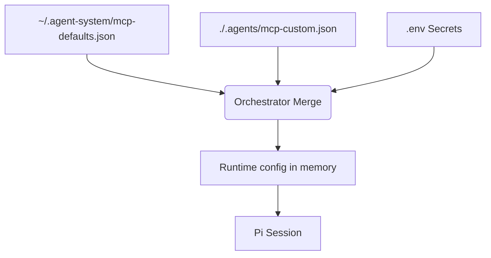

# Extensibility & MCP Servers

Model Context Protocol (MCP) servers give agents real-world capabilities (GitHub, Databases, API access) without complex custom bash scripts. 

## Hybrid MCP Configuration
MCPs can be run locally via `stdio` (great for solo devs) or remotely via `sse` (great for enterprise teams). 

Config relies on deep-merging two files at runtime:
1.  **Global Defaults:** `~/.agent-system/versions/v0.1.0/config/mcp-defaults.json` (Batteries included: GitHub, SQLite, Exa Search).
2.  **Local Overrides:** `./.agents/mcp-custom.json` (Project-specific servers like Figma or Stripe).

## Secure Secrets (`.env` Interpolation)
API keys for MCP servers must **never** be checked into version control. The Orchestrator handles dynamic `.env` interpolation.

**Example `mcp-custom.json`:**
```json
{
  "github-mcp": {
    "transport": "stdio",
    "command": "npx",
    "args": ["-y", "@modelcontextprotocol/server-github"],
    "env": {
      "GITHUB_PERSONAL_ACCESS_TOKEN": "${GITHUB_TOKEN}"
    }
  }
}
```
Before booting a `pi` session, the Orchestrator reads your local `.env`, replaces `${GITHUB_TOKEN}`, and constructs a temporary, secure MCP payload in memory.

### Configuration Merge Workflow
