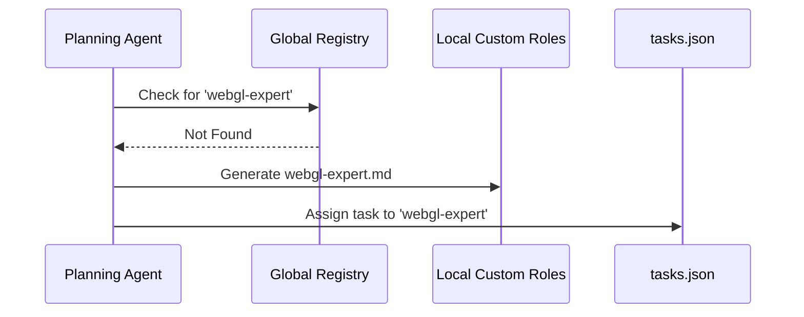

# Roles & Playbooks

## Playbook Presets
A 13-step pipeline is overkill for a typo fix. The `agent-pipeline.yml` specifies predefined Playbooks:
*   `playbook: full-stack-epic` (The entire 13-step lifecycle).
*   `playbook: fast-feature` (Skips PM/PRD; goes straight to Architecture -> Planning -> Implementation).
*   `playbook: bug-fix` (Skips Architecture; goes Memory -> Planning -> Implementation -> Review).
*   `playbook: refactor` (Dedicated playbook that swaps out feature roles for a `migration-architect` to handle tech debt safely).

## Agentic Team Building (Dynamic Recruitment)
We do not hardcode 50 specialist roles. We start with a minimal core team.
During the `planning` phase, if a task requires highly specific domain knowledge (e.g., WebGL Shaders), the `planning` agent uses the `role-recruiter` skill.

It defines the required persona and writes a new prompt to `./.agents/custom-roles/webgl-expert.md`. The `task-selector` will then spawn this bespoke agent for the task. 

*(Highly successful custom roles can be PR'd to the community registry to be included in future global system releases).*

### Dynamic Recruitment Workflow

## LLM Model Tiering
The `agent-pipeline.yml` allows binding specific model classes to specific roles to optimize speed and cost:
*   `planning`: `reasoning-tier` (e.g., o1, claude-3-5-sonnet)
*   `verification`: `fast-tier` (e.g., claude-3-haiku, local OSS models)