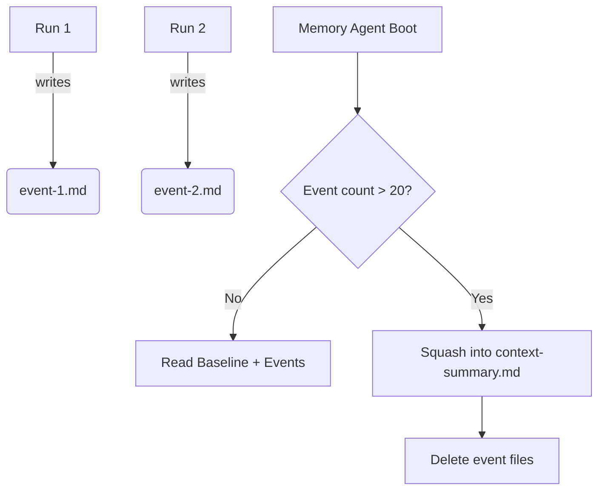

# Memory Management

## Event-Sourced Memory
In a team environment, having AI agents constantly overwrite a central `context-summary.md` file leads to catastrophic Git merge conflicts when multiple developers are working on concurrent branches.

To solve this, AI memory is treated as an append-only event log.
During the `memory-update` phase, the agent writes a unique, timestamped file to the local directory:
`./.agents/memory-events/event-1715420000.md`

Because each event is a unique file, Git handles branch merges flawlessly.

## Memory Auto-Compression
When a new run begins, the `memory-agent` reads the baseline `context-summary.md` AND all recent event files to build its runtime context.

If the number of event files exceeds the configuration threshold (e.g., `max_memory_events: 20`), the Orchestrator triggers an auto-compress phase. The AI squashes all lessons into a new baseline `context-summary.md`, deletes the event files, and commits the clean state.

::: info 🧠 Token Optimization
Auto-compression prevents the Context Window from degrading over time. A highly compressed baseline document is cheaper and faster for the LLM to process than 20 individual event files.
:::

### Auto-Compression Workflow
